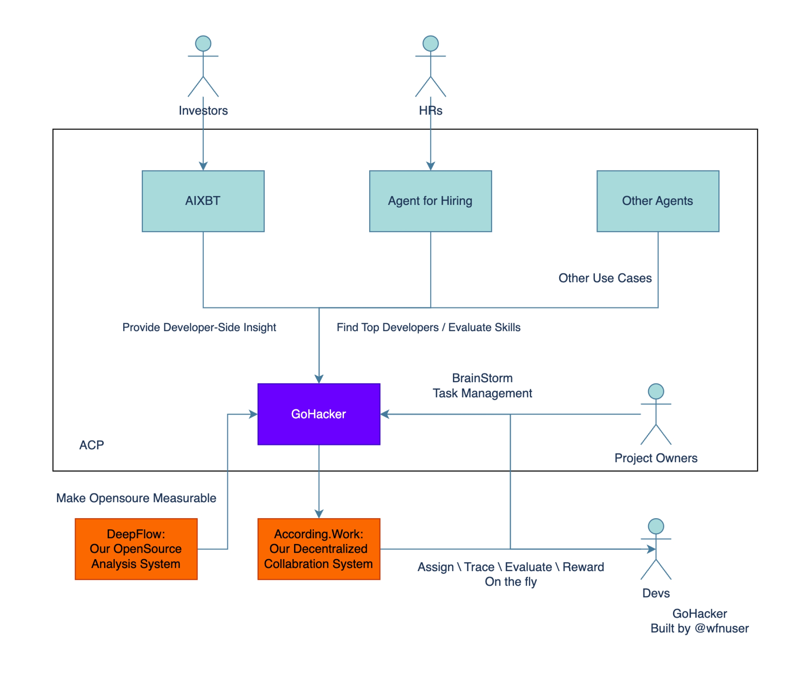

# GoHacker - AI-powered GitHub Agent with ACP Integration



GoHacker is an AI-powered GitHub agent integrated with the Autonomous Crypto Payments (ACP) system, serving as a bridge between investors and developers in the web3 ecosystem.

## 🌟 Overview

GoHacker provides dual perspectives to serve different stakeholders in the blockchain and open-source communities:

### For Investors

Technical analysis of projects from a developer's viewpoint, helping you understand the technical merit and potential of projects you're interested in.

### For Project Owners

Development planning assistance by identifying suitable developers, creating structured task breakdowns, and managing reward distributions. When your project receives donations through ACP, GoHacker ensures fair and automatic distribution of funds to all contributors based on their historical contributions.

## 💰 Autonomous Crypto Payments (ACP)

GoHacker leverages the innovative Autonomous Crypto Payments (ACP) system developed by Virtuals.io, which revolutionizes how open-source projects receive funding and distribute rewards.

### What is ACP?

ACP is a groundbreaking protocol that enables:

- **Autonomous Payment Flows**: Smart contracts that automatically route crypto payments to the right contributors based on their verifiable contributions to a project
- **Contribution-Based Distribution**: Fair and transparent reward allocation using on-chain data from GitHub contributions and other verifiable sources
- **Continuous Funding Model**: Projects can receive ongoing funding that's automatically distributed to active contributors, creating sustainable open-source ecosystems
- **Incentive Alignment**: Aligns the incentives of funders, project owners, and contributors through transparent, merit-based reward systems

### How ACP Works with GoHacker

1. **Contribution Tracking**: GoHacker analyzes GitHub repositories to identify and quantify individual contributions
2. **Smart Distribution**: When a project receives funding through ACP, GoHacker's AI determines fair distribution ratios based on contribution value
3. **Automated Payments**: Smart contracts execute payments to contributors' wallets without manual intervention
4. **Transparent Records**: All distributions are recorded on-chain, providing complete transparency for all stakeholders

### Benefits of ACP Integration

- **For Funders**: Confidence that funds directly reach the actual contributors who create value
- **For Project Owners**: Reduced administrative overhead in managing contributor payments
- **For Contributors**: Guaranteed fair compensation based on actual work, not subjective evaluations
- **For the Ecosystem**: Creation of sustainable funding models for open-source development

## 📋 User Stories & Scenarios

### As an Investor

**Technical Due Diligence Made Simple**

> "As a crypto venture capitalist without deep technical knowledge, I struggle to evaluate the technical quality of projects I'm considering for investment. With GoHacker, I can analyze any GitHub repository and receive a comprehensive technical assessment in plain language. The radar charts visualize code quality, documentation, test coverage, and security metrics, helping me identify potential red flags or promising indicators. I can download these analyses as PDF reports to share with my investment team during our decision-making process."

**Competitive Analysis**

> "When comparing similar projects in the DeFi space, I need to understand the technical differences that might impact long-term success. GoHacker helps me compare multiple repositories side by side, highlighting architectural differences, development velocity, and code quality metrics. This gives me confidence in my investment decisions based on technical fundamentals, not just marketing promises."

### As a Project Owner

**Efficient Development Planning**

> "As the founder of a new web3 project, I have a vision but struggle with breaking it down into technical tasks. GoHacker analyzes my project requirements and automatically generates a structured development roadmap with GitHub issues. It suggests task priorities, estimates complexity, and even identifies potential technical challenges before development begins."

**Talent Matching & Reward Distribution**

> "Finding the right developers for specific tasks is challenging, especially in specialized areas like zero-knowledge proofs or layer-2 solutions. GoHacker analyzes my project needs and matches them with developers who have demonstrated relevant skills in their GitHub history. When my project receives funding through ACP, GoHacker ensures fair distribution of rewards based on actual contributions, maintaining transparency and motivation among team members."

**Community Engagement**

> "Managing an open-source project with hundreds of contributors is overwhelming. GoHacker helps me identify valuable community contributions, suggest appropriate bounties for open issues, and maintain clear communication with contributors. This has dramatically increased community engagement and the quality of submissions."

### As a Developer

**Skill-Based Opportunity Discovery**

> "As a Solidity developer specializing in security audits, I want to find projects that can benefit from my expertise. GoHacker matches me with projects that have identified security needs or vulnerabilities, allowing me to contribute where my skills add the most value. The platform highlights my security expertise to project owners, increasing my chances of being selected for high-impact tasks."

**Fair Compensation**

> "Working on open-source projects often means uncertain or delayed compensation. With GoHacker's integration with ACP, I receive automatic payments based on my merged contributions. The system transparently tracks my work across multiple projects and ensures I'm fairly compensated according to pre-agreed terms, without having to chase payments or negotiate after the work is done."

**Skill Development**

> "I want to expand my blockchain development skills beyond my current expertise. GoHacker recommends 'good first issues' in areas I'm looking to develop, provides context about the codebase, and connects me with mentors who can review my work. This guided approach has helped me transition from frontend development to smart contract programming while earning along the way."

## 🔧 Installation & Setup

### Prerequisites

- Node.js (v18 or higher)
- pnpm package manager
- API keys for required services

### Environment Variables

Create a `.env` file in the project root with the following variables:

```
API_KEY=your_virtuals_protocol_api_key
OPENAI_API_KEY=your_openai_api_key
GITHUB_TOKEN=your_github_token
GITHUB_REPO_OWNER=default_repo_owner
GITHUB_REPO_NAME=default_repo_name
VITE_GOHACKER_URL=your_backend_url
```

### Installation

```bash
# Install dependencies
pnpm install

# Start development servers
pnpm --filter web dev
pnpm --filter agent start:dev

# Build for production
pnpm --filter web build
pnpm --filter agent build
```

## 🌐 Deployment

### Backend Deployment

1. Build the NestJS application
2. Set up environment variables on your server
3. Use PM2 for process management
4. Configure Nginx as a reverse proxy (optional)

### Frontend Deployment

1. Build the React application
2. Deploy to Netlify, Vercel, or your preferred hosting service
3. Configure environment variables in your hosting platform

## 🤝 Contributing

Contributions are welcome! Please feel free to submit a Pull Request.

## 📄 License

This project is licensed under the MIT License - see the LICENSE file for details.

## 🙏 Acknowledgements

- [YoubetDAO](https://youbetdao.com) for project sponsorship
- [Virtuals Protocol](https://virtuals.io) for AI agent capabilities
- All contributors who have helped shape this project
